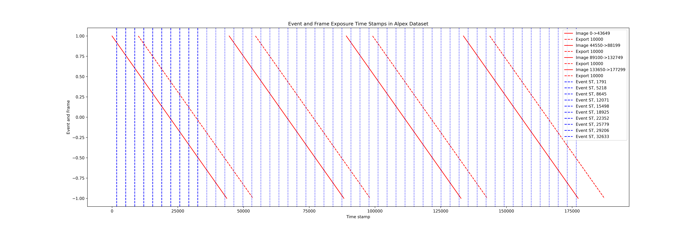

# Self-Supervised Event-guided Rolling Shutter Frame Interpolation (Self-EvRSVFI)



Official PyTorch implementation of the paper:

> **Self-supervised Learning of Event-guided Video Frame Interpolation for Rolling Shutter Frames**
> Yunfan Lu*, Guoqiang Liang*, Yiran Shen, and Lin Wang†
<!-- > *IEEE Transactions on Visualization and Computer Graphics (TVCG), 2025* -->
> [PDF](https://arxiv.org/pdf/2306.15507) | [Video](#)

## 📌 Introduction

We propose **EGVFI**, a **self-supervised framework** that leverages **event cameras** and **rolling shutter (RS) images** to reconstruct high-frame-rate **global shutter (GS) videos**. Our method estimates a **3D displacement field** (DF) that enables both **RS-to-GS conversion** and **slow-motion video interpolation**, even under complex, non-linear motion.

**Key Highlights:**
- Self-supervised learning, no need for paired GS/RS supervision.
- High-quality VFI up to **32× interpolation**.
- Bandwidth reduced by over **94%**.
- Inference time: **16 ms per frame**.

## 📁 Project Structure

```
egvfi/
├── core/                # Training and optimization logic
├── datasets/           # Datasets and loading logic
├── functions/          # Warping and coordinate utilities
├── losses/             # Loss functions (Charbonnier, SSIM, LPIPS, etc.)
├── models/             # Core models (CGSVR, E-RAFT, UNet, etc.)
├── utils/              # Utilities for padding, visualization, etc.
├── main.py             # Entry point for training and testing
options/                # Experiment configs (YAML + shell scripts)
images/                 # Example timestamp visualizations
```

## 🚀 Getting Started

### Requirements

```bash
conda create -n egvfi python=3.9
conda activate egvfi
pip install -r requirements.txt
```

Ensure you have a GPU with CUDA enabled (tested on NVIDIA RTX A30).

### Dataset Preparation

We support the following datasets:

- **Fastec-RS** (simulated GS + event + RS)
- **Gev-RS** (high-speed GS, simulate RS and events)
- **ERS** (real-world RS-event dataset, collected with ALPIX-Eiger)
   - Link: https://pan.baidu.com/s/1UBDBnUZp8CxS9nCz5jyUcw Key: tvcg    

Each dataset has its own dataloader in `egvfi/datasets`. Please follow the instructions in `egvfi/datasets/README.md` (add if not exists) to prepare data and annotations.

### Training

```bash
bash options/aplex-vfi-dataset/cgsvr-32x-aplex-self-v1.sh
```

Modify the config file if needed:
```bash
vim options/aplex-vfi-dataset/cgsvr-32x-aplex-self-v1.yaml
```

### Evaluation & Visualization

```bash
python egvfi/main.py --eval --config <your_config.yaml>
```

Intermediate results and final interpolated frames will be saved for visualization. Warp weights and occlusion maps can also be visualized with `flow_viz.py`.

## 📊 Benchmarks

| Dataset     | Method              | 32× PSNR ↑ | SSIM ↑ | LPIPS ↓ |
|-------------|---------------------|------------|--------|---------|
| Fastec-RS   | **Ours**            | 26.31      | 0.8074 | 0.0836  |
| Gev-RS      | **Ours**            | 23.88      | 0.8074 | 0.0702  |

See the paper for full comparison with CVR, RSSR, TimeLens, EvUnRoll + TimeReplayer.

## 🧠 Method Overview

Our pipeline consists of three major modules:

1. **Displacement Field Estimation (DFE)**
   Event-based E-RAFT estimates dense spatiotemporal optical flows.

2. **Latent GS Frame Generation**
   GS frames at arbitrary timestamps are warped from RS frames via DF.

3. **Reciprocal Reconstruction**
   RS ↔ GS supervision via GS-to-RS and RS-to-RS warping for self-supervision.

## 📎 Citation

If you find this project useful, please cite our work:

<!-- ```bibtex
@article{lu2025self,
  title={Self-supervised Learning of Event-guided Video Frame Interpolation for Rolling Shutter Frames},
  author={Lu, Yunfan and Liang, Guoqiang and Shen, Yiran and Wang, Lin},
  journal={IEEE Transactions on Visualization and Computer Graphics},
  year={2025}
}
``` -->

```bibtex
@article{lu2025self,
  title={Self-supervised Learning of Event-guided Video Frame Interpolation for Rolling Shutter Frames},
  author={Lu, Yunfan and Liang, Guoqiang and Shen, Yiran and Wang, Lin},
  year={2025}
}
```

## 🤝 Acknowledgements

This repo is built upon components from:
- [E-RAFT](https://github.com/uzh-rpg/E-RAFT)
- [TimeLens](https://github.com/uzh-rpg/rpg_timelens)
- [SoftSplat](https://github.com/sniklaus/softmax-splatting)

